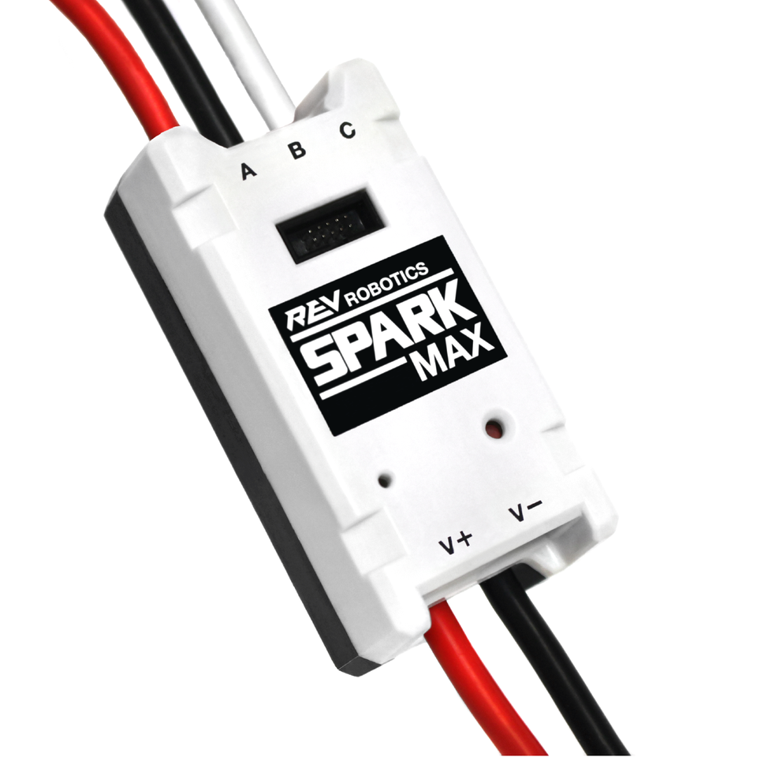

ismail - not proofread nor complete

# SparkMax

Can be found in the Mech Room on the gray shelves (not to be confused with the toolcarts).

## Overview

Sparkmaxes are the [motor controllers](https://en.wikipedia.org/wiki/Motor_controller) of choice for 8726, at least for our [REV motors](rev_motors.md). They can be configured, analyzed, and controlled via a USB connection using [REV Hardware Client](rhc.md).

## Ports

| Port         | Wire Type   | Current Draw  | Required | Where is it?            | Additional Info        |
| ------------ | ----------- | ------------- | -------- | ----------------------- | ---------------------- |
| CAN port   | 22 gauge |  amps  | &check;  | Side connecting to PDH, next to USB-C port | Used to connect the [CAN bus](../electrical/electrical.md) |
| 6-pin Encoder port   | 22 gauge    |  amps | &check;  | Side connecting to motor  | Enables connection to the motor's encoder |

## Status Lights
